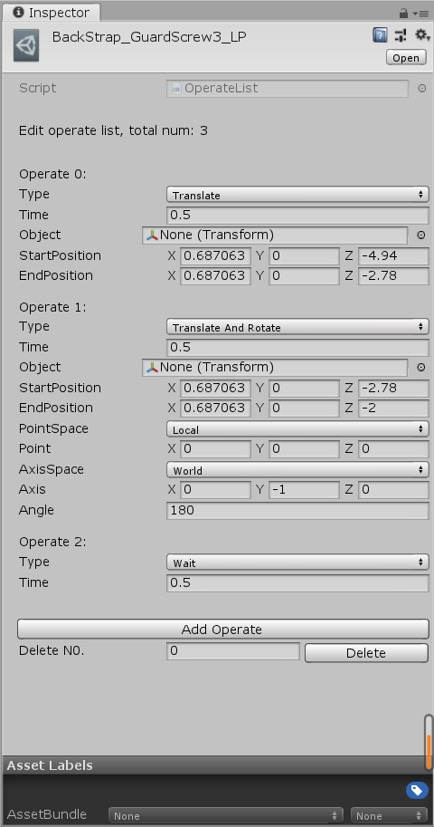
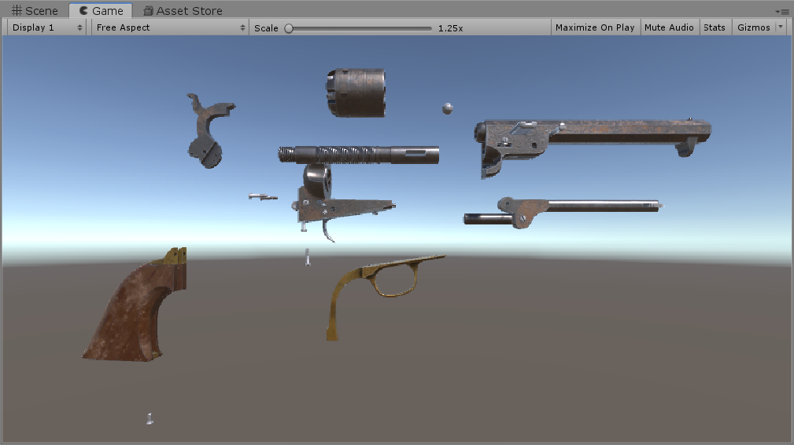
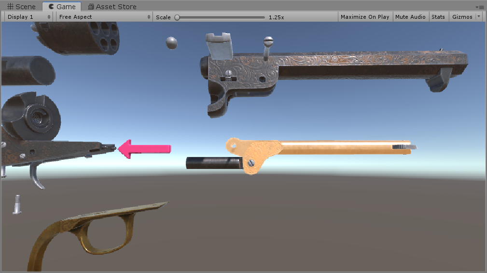
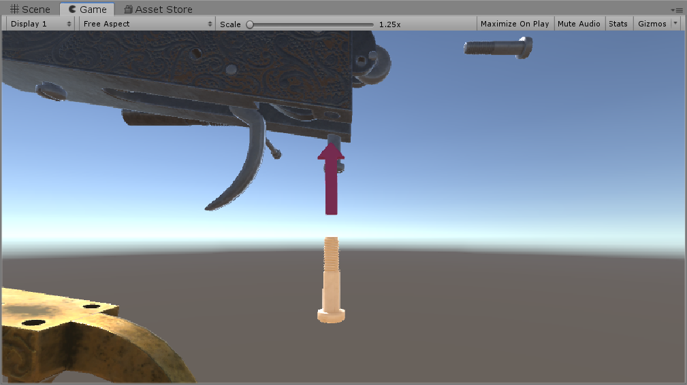
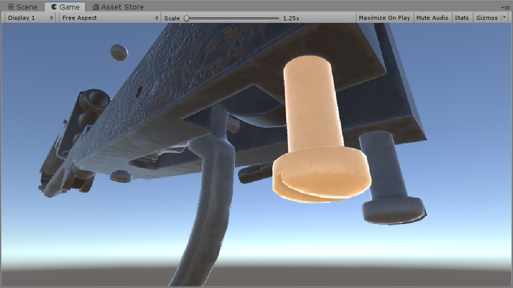

# GunDemo

一款模拟枪械拼装的虚拟仿真项目
 
 
操作仿照游戏World of Guns: Gun Disassembly，面对散乱的零件，用户需要点选正确的组件以按照正确的顺序组装枪械。 
点击正确的零件，该零件高亮并出现相应的操作箭头，镜头会平滑跳转至该零件的特写位置，错误的零件则只会高亮而没有箭头。 
操作之后会播放零件组装动画。 
鼠标左键控制镜头旋转，右键平移镜头，滚轮缩放 
 
组装顺序的安排采用树状数据结构，叶子结点即当前可操作性零件，操作完成后该节点消失。 
某内部节点的所有子节点均完成后，该节点成为可操作节点，当只有根节点是可操作性节点时，组装完成。 
零件组装动画采用scriptobject安排，系统会根据scriptobject中的列表来对对应零件执行相应的操作，主要包括平移、旋转、平移并旋转三类。 

 
 
截图：

